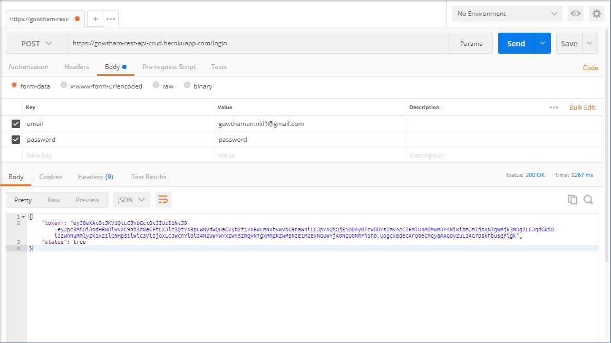
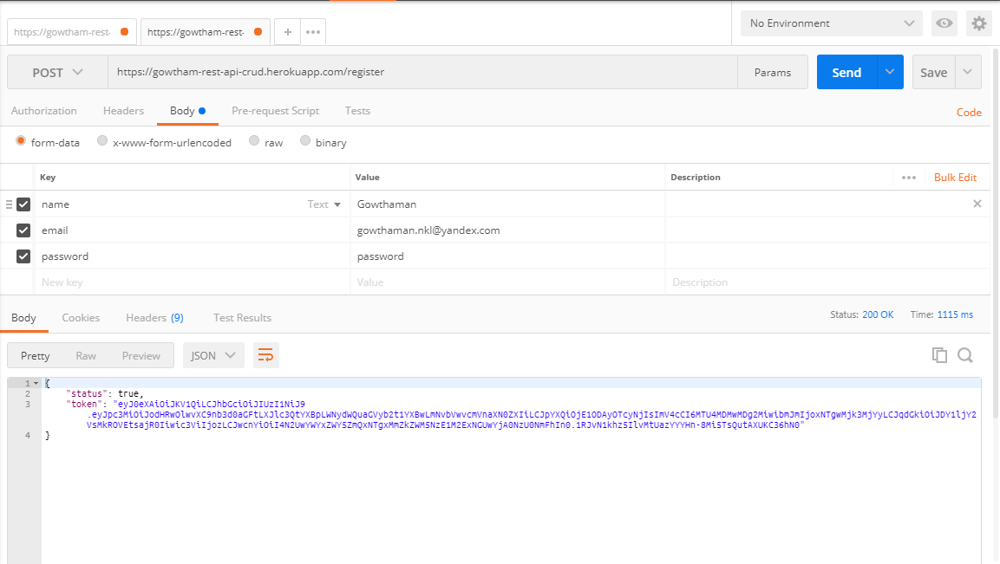
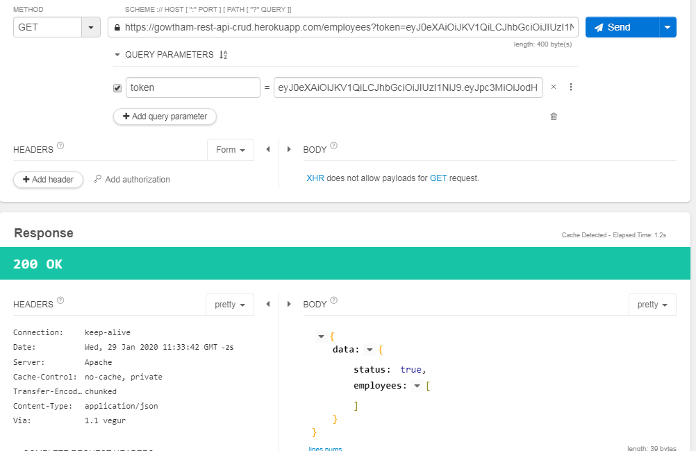
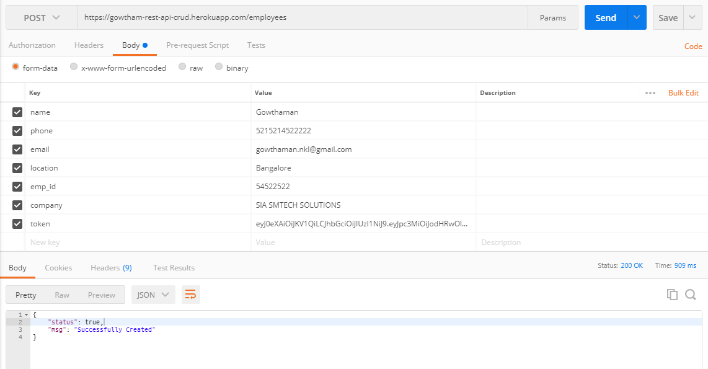
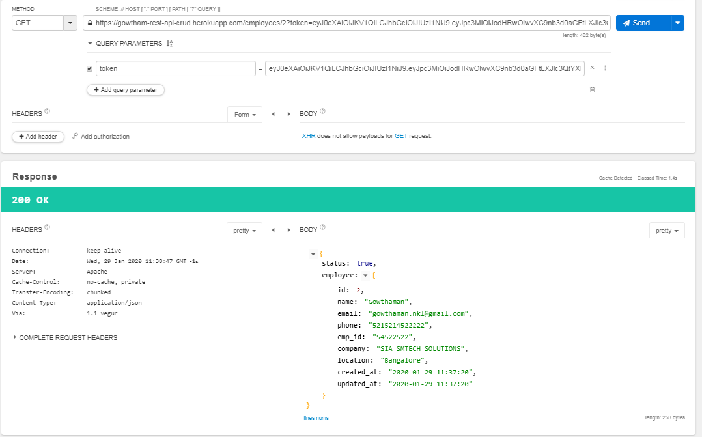
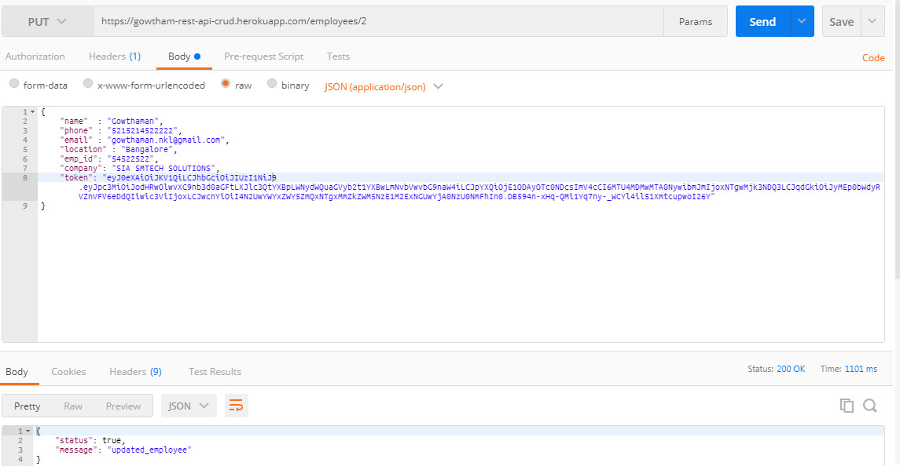
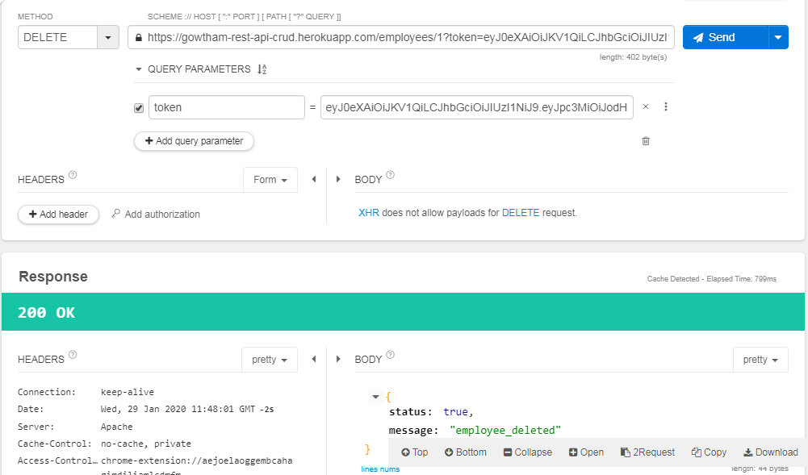
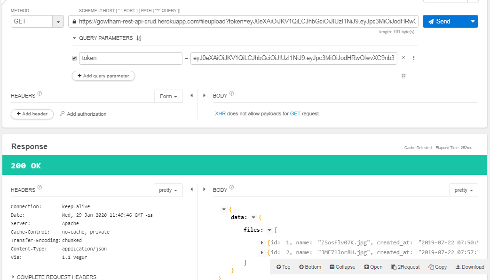
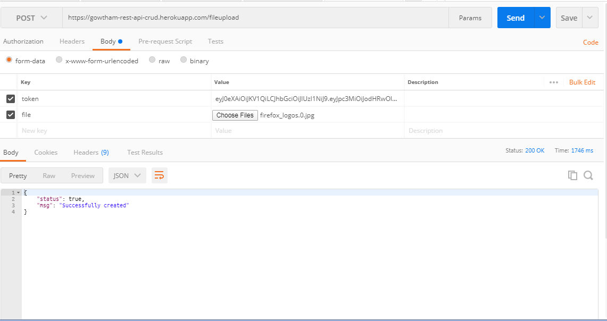

## About Laravel - JWT Auth

Laravel is a web application framework with expressive, elegant syntax. We believe development must be an enjoyable and creative experience to be truly fulfilling. Laravel attempts to take the pain out of development by easing common tasks used in the majority of web projects, such as:

- [Simple, fast routing engine](https://laravel.com/docs/routing).
- [Powerful dependency injection container](https://laravel.com/docs/container).
- Multiple back-ends for [session](https://laravel.com/docs/session) and [cache](https://laravel.com/docs/cache) storage.
- Expressive, intuitive [database ORM](https://laravel.com/docs/eloquent).
- Database agnostic [schema migrations](https://laravel.com/docs/migrations).
- [Robust background job processing](https://laravel.com/docs/queues).
- [Real-time event broadcasting](https://laravel.com/docs/broadcasting).

Laravel is accessible, yet powerful, providing tools needed for large, robust applications.

## Learning Laravel Auth Using JWT

Laravel has the most extensive and thorough [documentation](https://laravel.com/docs) and video tutorial library of any modern web application framework, making it a breeze to get started learning the framework.

If you're not in the mood to read, [Laracasts](https://laracasts.com) contains over 1100 video tutorials on a range of topics including Laravel, modern PHP, unit testing, JavaScript, and more. Boost the skill level of yourself and your entire team by digging into our comprehensive video library.

## API  URL 
    
-   [API URL's](https://gowtham-rest-api-crud.herokuapp.com)
   

We would like to extend our thanks to the following sponsors for helping fund on-going Laravel development. If you are interested in becoming a sponsor, please visit the Laravel [Patreon page](https://patreon.com/taylorotwell):
 

## Contributing

Thank you for considering contributing to the Laravel framework! The contribution guide can be found in the [Laravel documentation](https://laravel.com/docs/contributions).

## Further Enquiry or Contact 

If you have any kind of doubt or query please send an e-mail to Gowthaman D via [gowthaman.nkl1@gmail.com](mailto:gowthaman.nkl1@gmail.com). All security vulnerabilities will be promptly addressed.

## License

The Laravel framework is open-sourced software licensed under the [MIT license](https://opensource.org/licenses/MIT).
## Login

## Register

## Employee List

## Add Employee 

## GET Employee 

## Update Employee 

## Delete Employee 

## Uploaded File List 

## File Uploaded 

